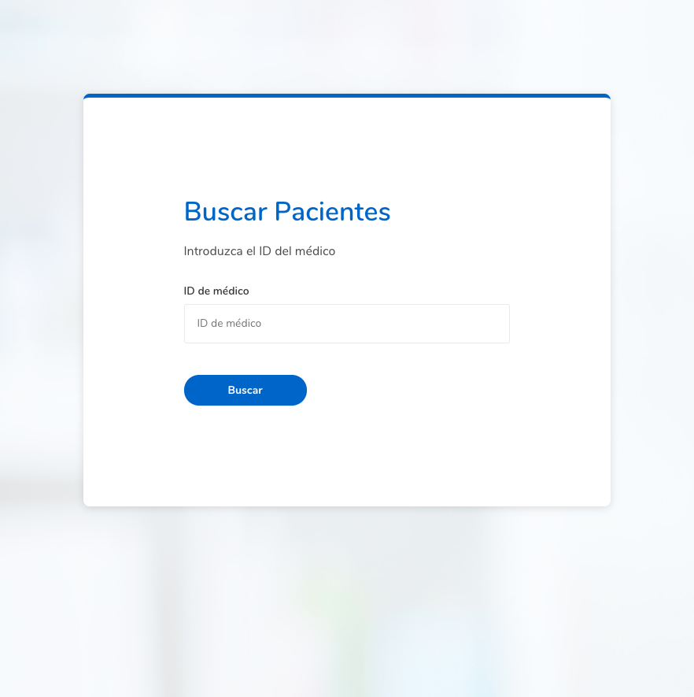
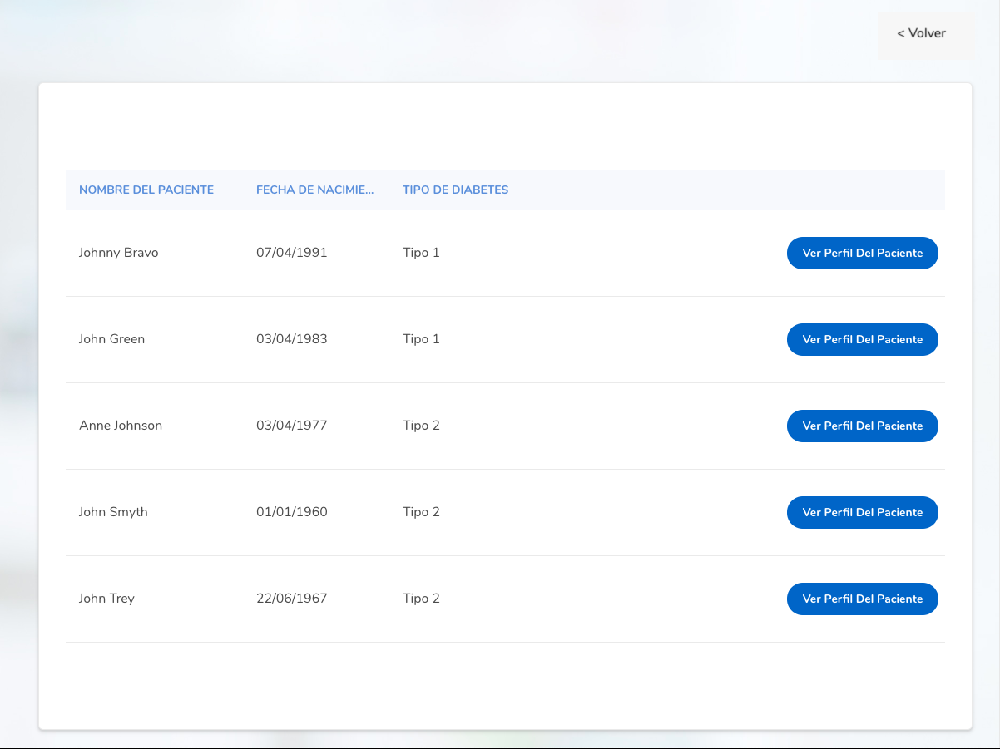
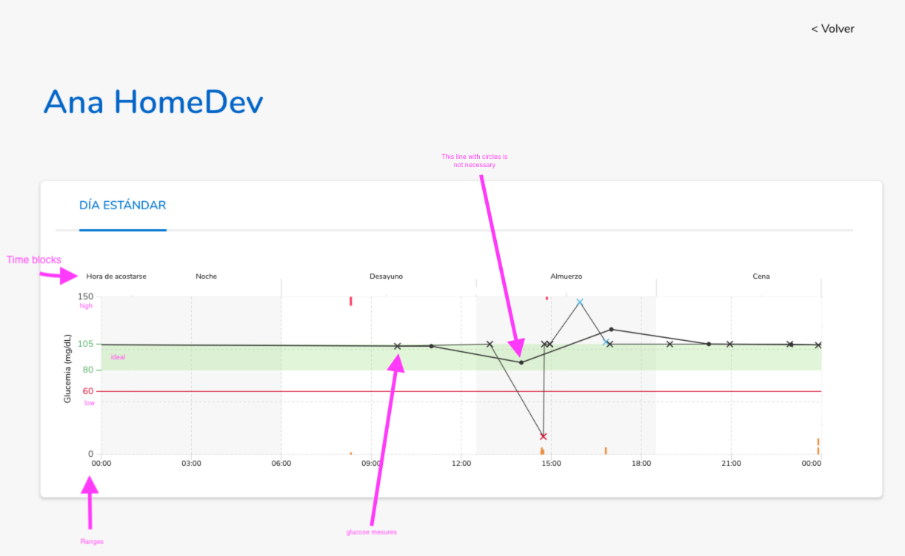

# Roche

ʀᴏᴄʜᴇ is a Swiss :switzerland: multinational healthcare company that operates worldwide under two divisions: Pharmaceuticals :pill: and Diagnostics :microscope:. Its holding company, Roche Holding AG, has bearer shares listed on the SIX Swiss Exchange. The company headquarters are located in Basel. Roche is the largest pharmaceutical company in the world :globe_with_meridians:, and the leading provider of cancer treatments globally.

You can read more in [Wikipedia](https://en.wikipedia.org/wiki/Hoffmann-La_Roche)

## What about this project?

This project is a Job Challenge :man_technologist:!

###      :medal_military: Objetive

          As a Hospital manager I would like to have a web app that:

          :white_small_square: Show list of patients assigned to a practitioner  
          :white_small_square: When selecting each patient, it shows a graph using the glucose measures uploaded.  
          :white_small_square: It has to be able to return results by using a practitioner ID.  
          :white_small_square: Doesn’t need a login screen.  
          :white_small_square: Should have 3 sections  
                      :small_blue_diamond: Home  
                      :small_blue_diamond: Patient List  
                      :small_blue_diamond: Gloucose graph measure  

###      :dart: Aspects to Focus

          :white_small_square: Maintainable and well-written code using good functional programming practices.  
          :white_small_square: We like to see good vanilla JS, but for this test we are looking for a react application.  
          :white_small_square: Browser support: IE11+, latest 2 versions of Chrome, Firefox, Safari.

###      :warning: Important!
             :white_small_square: It’s OK to read the provided JSON file all at once.  
             :white_small_square: The app does not need to looks exactly like in the screenshots, they should be used as a guidance.

## :art: Design Reference

#### Home 
This should contain a component that will allow the practitioner to input his/her user id and if the user id is valid it should navigate to the list section and show the results, otherwise it should show a message saying that the user id is not valid.

#### Patient List
This section should show the results of all the patients assigned to that practitioner, showing a scrollable list (if it is needed) and the name, DoB, the diabetes type and a button to navigate to the graph section

#### Glucose Measure Graph
Using the data for each patient a graph showing the evolution of a single day should be created as in the screenshot provided, using the ‘glucoseMesures’ (GM) values from the json file, the graphic should be created dynamically using the ‘ranges’ value for each patient (have a look at graph.png for correlations). 
Each glucose measure should be represented by a cross and on roll over should show the data for that GM and it should use a different color depending on its level (have look at tooltips images).

## :package: Tech Stack

- **React:** Library for building user interfaces.
- **Redux:** Predictable state container for JavaScript Apps.
- **Redux-observable**: Middleware for action side effects in Redux using "Epics"
- **Reselect**: Simple “selector” library for Redux.
- **Ramda**: Practical functional Javascript
- **Axios**: Promise based HTTP client for the browser and node.js
- **Styled-components**: Use tagged template literals to style your components.
- **Polished**: A lightweight toolset for writing styles in JavaScript
- **Jest:** Zero configuration testing platform
- **Enzyme:** javaScript Testing utility for React that makes it easier to assert, manipulate, and traverse your React Components' output.
- **Typescript**: A superset of JavaScript that compiles to clean JavaScript
